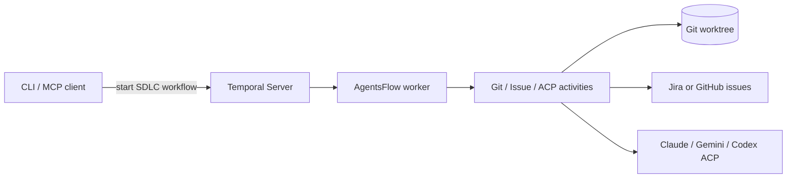

AgentsFlow
==========

Temporal workflows and activities for the AgentsFlow SDLC automation stack. This README is intentionally thin—full operator and contributor docs live at [docs.agentsflow.dev](https://docs.agentsflow.dev). New operators can jump straight to the Quickstart/Deployment guides on the docs site.

Architecture (high level)
-------------------------

Supported issue providers
-------------------------
| Provider | Credentials | Notes |
| --- | --- | --- |
| Jira | `JIRA_EMAIL` + `JIRA_API_TOKEN` (optional `JIRA_HOST_ALLOWLIST`, `JIRA_TIMEOUT_SECONDS`) | Hosts matching `atlassian.net`/`jira` or allowlisted domains route here. |
| GitHub | `GITHUB_TOKEN` (optional `GITHUB_TIMEOUT_SECONDS`) | Uses the GitHub Issues API for `github.com/<org>/<repo>/issues/<id>` URLs. |

Docs
----
- New operators: Quickstart + deployment: https://docs.agentsflow.dev
- SDLC workflow: https://docs.agentsflow.dev/workflows/sdlc
- Providers + env reference: https://docs.agentsflow.dev/guides/providers
