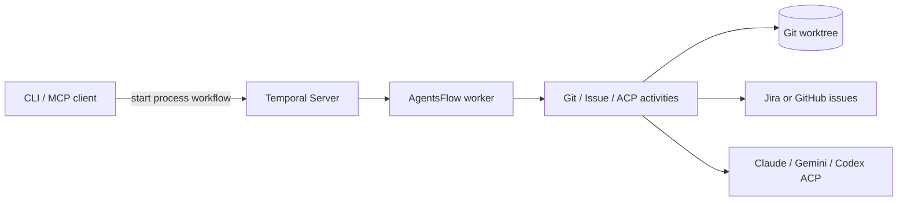

AgentsFlow
==========

[](https://docs.agentsflow.dev)

Temporal workflows and activities for the automation stack. This README is intentionally thin—full operator and contributor docs live at [docs.agentsflow.dev](https://docs.agentsflow.dev). New operators can jump straight to the Quickstart/Deployment guides on the docs site.

Quick start (MCP)
-----------------
The easiest way to run AgentsFlow is as an MCP server using `uvx` (part of [uv](https://github.com/astral-sh/uv)).

### Option 1: Use with AI Assistant (Recommended)
Run the following commands to add AgentsFlow as an MCP server.

**Claude Code**
```bash
claude mcp add agentsflow --scope user --env OPENAI_API_KEY=sk-... -- uvx agentsflow
```

**Gemini CLI**
```bash
gemini mcp add agentsflow --scope user --env OPENAI_API_KEY=sk-... -- uvx agentsflow
```

**Codex CLI**
```bash
codex mcp add agentsflow --env OPENAI_API_KEY=sk-... -- uvx agentsflow
```

**Cursor** (`.cursor/mcp.json` or via Settings > MCP)
```json
{
  "mcpServers": {
    "agentsflow": {
      "command": "uvx",
      "args": ["agentsflow"],
      "env": {
        "OPENAI_API_KEY": "sk-..."
      }
    }
  }
}
```

### Option 2: Standalone HTTP Server
To run the stack independently (e.g. for debugging or remote access):
```bash
uvx agentsflow --transport streamable-http
```

### Tracking Progress
Regardless of how you run it (Option 1 or 2), you can track workflow execution and status in the Temporal Web UI at http://localhost:8233.

### 3. Use it
Once connected, you can use natural language to trigger workflows:
- "Create a feature branch for issue JIRA-123"
- "Start the process workflow for the current repository"

Architecture (high level)
-------------------------


Supported issue providers
-------------------------
| Provider | Credentials | Notes |
| --- | --- | --- |
| Jira | `JIRA_EMAIL` + `JIRA_API_TOKEN` (optional `JIRA_HOST_ALLOWLIST`, `JIRA_TIMEOUT_SECONDS`) | Hosts matching `atlassian.net`/`jira` or allowlisted domains route here. |
| GitHub | `GITHUB_TOKEN` (optional `GITHUB_TIMEOUT_SECONDS`) | Uses the GitHub Issues API for `github.com/<org>/<repo>/issues/<id>` URLs. |

Docs
----
- New operators: Quickstart + deployment: https://docs.agentsflow.dev
- Process workflow: https://docs.agentsflow.dev/workflows/process
- Providers + env reference: https://docs.agentsflow.dev/guides/providers
