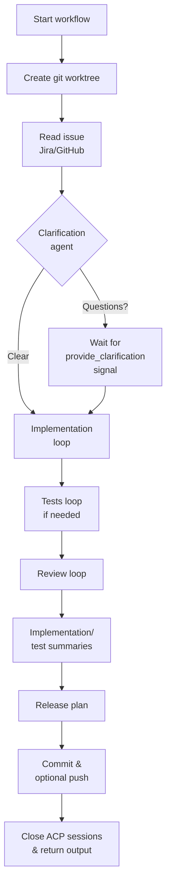

# Process Workflow

The `process_workflow` definition orchestrates the automation pipeline around Temporal, Git, issue providers, and ACP coding agents.

## High-level flow

## Stage details
- **Git worktree** (`create_git_worktree`, 4m timeout, 3 retries) – clones or reuses the source repository and prepares an isolated worktree rooted at the requested reference.
- **Issue ingestion** (`read_issue`, 2m timeout, 4 retries) – picks Jira or GitHub based on the URL and available credentials, returning normalized summary, description, status, and comments.
- **Clarification gate** (`run_clarification_agent`, 2m timeout) – halts the workflow if the agent flags missing requirements. Operators answer via the `provide_clarification` signal; status is exposed through the `clarification_status` query.
- **Implementation loop** – `run_acp_implementation` plus `parse_coding_transcript` feedback, up to 4 attempts. Feedback from evaluation is passed back into subsequent prompts.
- **Tests loop (conditional)** – Runs when evaluation shows missing automated tests. Up to 5 attempts to have the coding agent add coverage, re-evaluating after each pass.
- **Review loop** – `run_acp_review` followed by `parse_review_transcript`; up to 5 attempts until approval is granted. Review feedback is fed back into the coding agent if changes are needed.
- **Summaries** – Generates implementation and (when tests exist) testing summaries for traceability via `summarize_implementation` and `summarize_tests`.
- **Release planning** – `draft_release_plan` proposes a branch, commit message, PR title/body, and follow-up items. CLI branch overrides take precedence.
- **Finalize git changes** (`finalize_git_changes`, 2m timeout) – checks out the branch, stages and commits any changes, optionally pushes to the configured remote (push is off by default), and cleans up the temporary worktree.
- **Session cleanup** – Both coding and review ACP sessions are closed even on failure paths.

## Inputs and outputs
- **Inputs:** repository path/URL, optional reference, issue URL, optional branch override, and coding agent provider (`claude`/`gemini`/`codex`).
- **Outputs (`ProcessWorkflowOutput`):** repository path, reference, ACP session IDs, coding transcripts, issue payload, implementation/test/review artifacts, release plan, committed branch and SHA, and whether a push occurred.

## Operational notes
- Workflow IDs default to `process-<8 hex>`. Poll progress via the `clarification_status` query or the Temporal Web UI.
- Activity retries are constrained; repeated failures (missing credentials, git push issues) surface as non-retryable `ApplicationError`s.
- Temporary worktrees are removed after finalization. If a run crashes mid-flight, clean up any `temporal-worktree-*` directories left behind.
